# Shonan for RasPI4

Raspberry Pi 4 + ADALM-Pluto+によるDVB-S2 DATV送受信タッチGUIシステム。
本体は`pi4/`配下(Python/PyQt5。DFRobot DFR0550は`linuxfb`、公式DSIタッチ画面は`eglfs`で描画)。同系統の別プラットフォーム
移植版(Android/iOS)は別リポジトリ(`Shonan_Lite-android`/`Shonan_Lite-iPad`等)
で管理している。

## 主な機能

- **送信**: 周波数・シンボルレート(250k〜2 Msym/s)・FEC・変調方式(QPSK/8PSK)・出力減衰量を画面で設定し、
  UDP-TSでPluto+へ送ってPluto内蔵の変調器(`pluto_dvb`)で送信する(Plutoの設定はSSHで`/www/settings.txt`へ
  書き込み、送信先ポートは8282固定)。FECは変調方式ごとに動作する組み合わせだけを選べる
  (QPSK: 1/2・3/5・8/9、8PSK: 3/5・8/9)。H.264はPi 4内蔵のハードウェアエンコーダ(`h264_v4l2m2m`)で符号化し、
  送信映像はフルHD(1920x1080)固定。送信は映像のみ(音声なし)。送信画面には出力減衰(dB)、
  Plutoへ送ったUDPパケット数、符号化したフレーム数を表示する。
- **映像ソース**: USBカメラ・画像ファイル(静止画を反復送信)・テストパターンから選ぶ。USBカメラは
  1280x720で取り込む(対応していればMJPEG・30fps、非対応カメラは既定の解像度)。カメラ選択時は
  「撮影」ボタンで静止画(JPG、`~/Pictures/Shonan_Lite/`)を撮り、そのまま送信画像に使える。
  コールサイン・備考を文字サイズ・文字色を選んで映像へ焼き込める(日時も表示)。
- **受信**: 外部復調機器からのUDP-TS受信、またはGNU Radio(gr-dvbs2rx)によるPi 4上でのオンデバイス復調。
- **RSSI測定**: 周波数を掃引して受信レベルをグラフ表示する。オンデバイス復調OFF(通常運用)では
  相手局の電波を測り、ON(テスト用)では自局もテストパターンで自動送信して自分の信号を測る。
- **プリセット**: 現在の設定を5件まで登録・呼び出し(プリセット1は未登録の間RFループバック試験用)。
- **機器試験**: 「全体試験」でPlutoを再起動したうえで、Pluto SDR接続・送信テスト・受信テスト・
  温度センサー(Pi 4のCPU温度)の4項目を順に確認し、TX/RXの総合結果を表示する。
- **その他**: Pluto URIの自動検出、日本語/英語表示、日本語オンスクリーンキーボード、アプリ内Help、
  起動時のアプリ選択(Shonan_Lite / Langstone)。DFRobot DFR0550(`linuxfb`)と公式DSIタッチ画面(`eglfs`)に対応。

## スクリーンショット

実機(DFR0550、800x480)の画面(2026-09-25撮影)。映像はすべてテストパターンで撮影している。
送信画面は送信中、RSSI測定はオンデバイス復調ONで「1回」実行した結果(自局のテストパターン信号)。

| Home画面 | 送信画面(TX) | 受信画面(RX) | RSSI測定 |
| --- | --- | --- | --- |
| 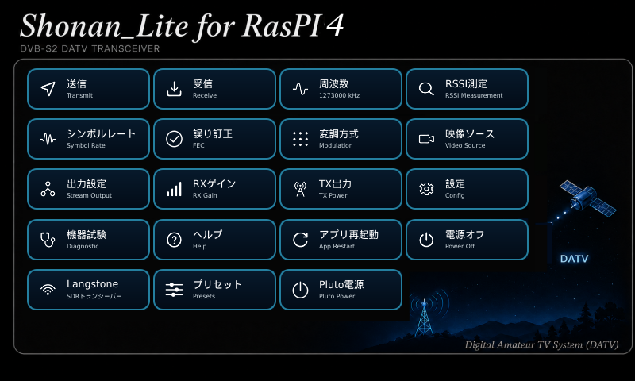 | 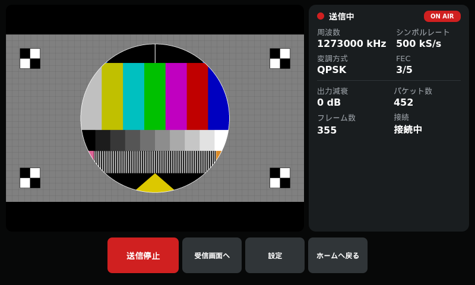 | 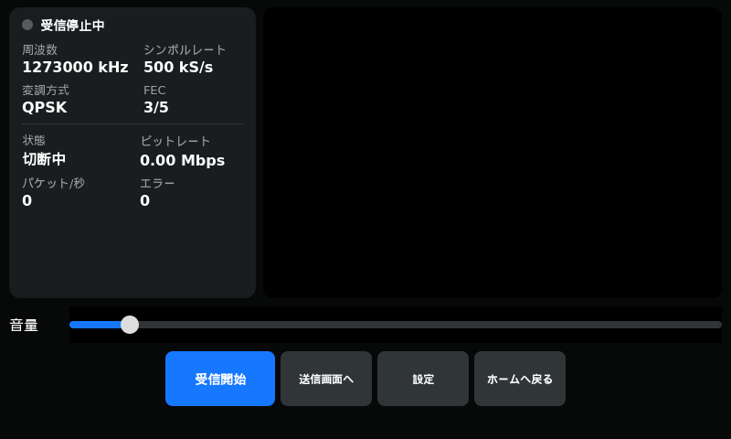 | 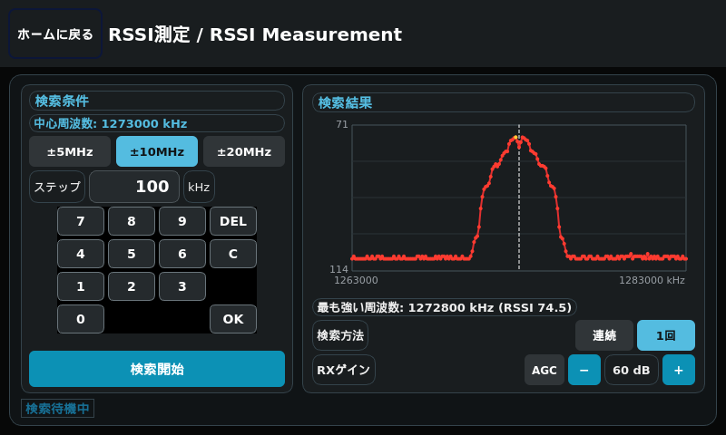 |

| 映像ソース | 変調方式 | 出力設定 | プリセット |
| --- | --- | --- | --- |
| 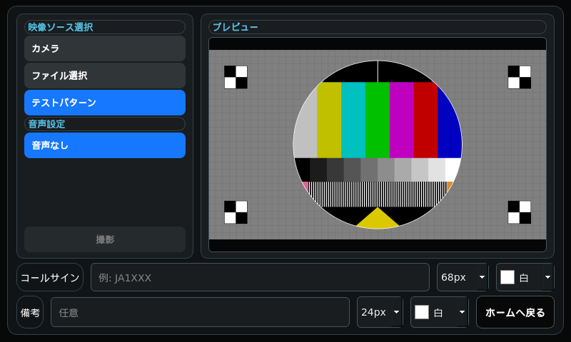 | 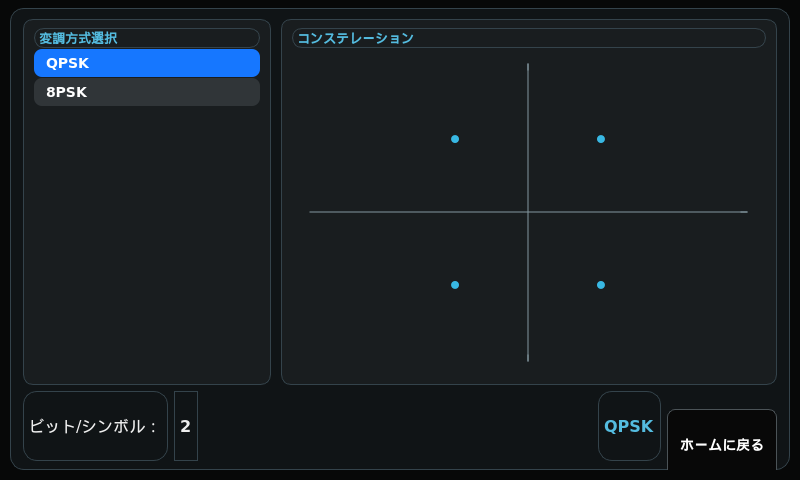 | 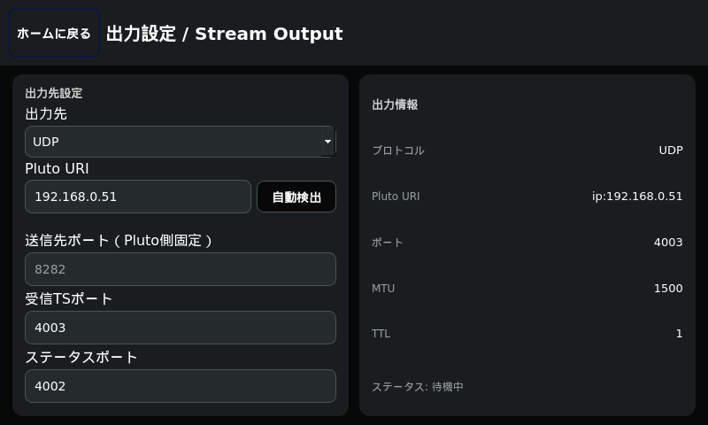 | 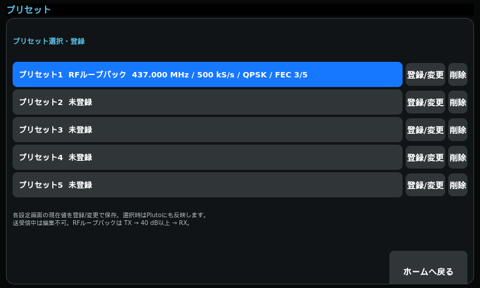 |

| 機器試験 | 設定 | 周波数 | 電源オフ |
| --- | --- | --- | --- |
| 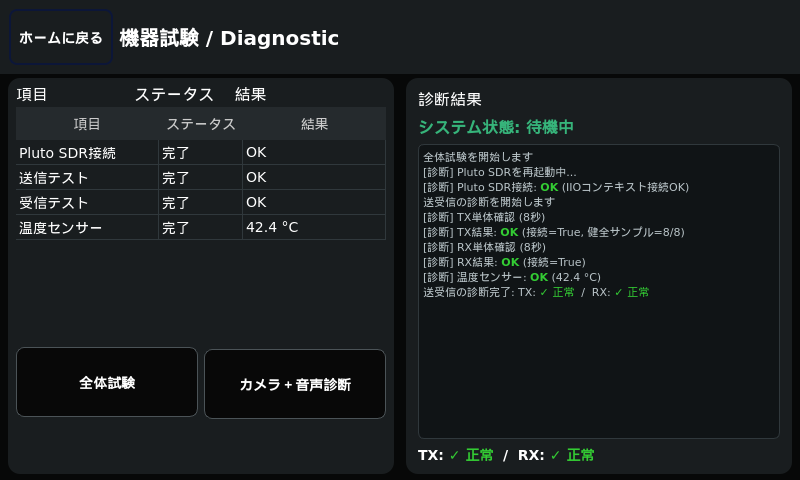 | 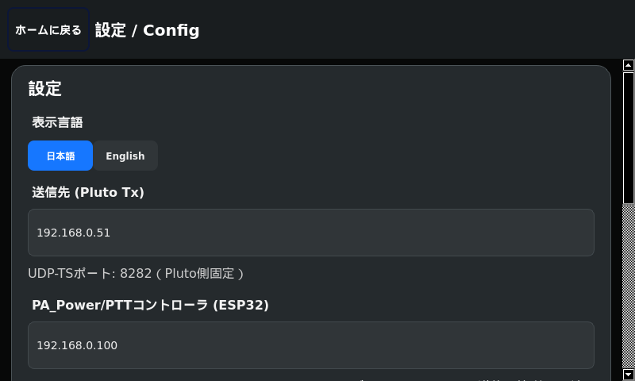 | 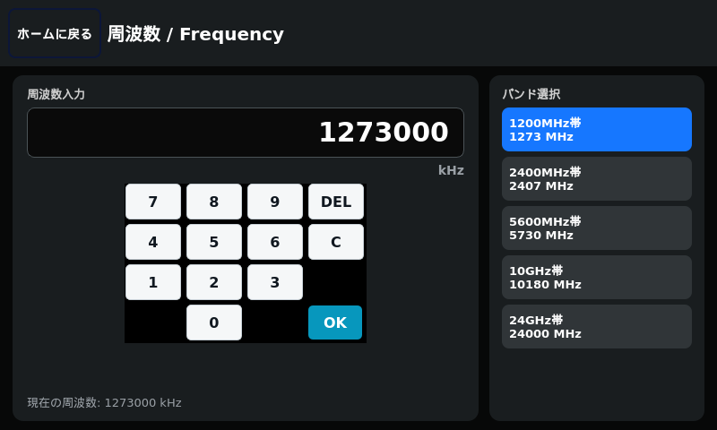 | 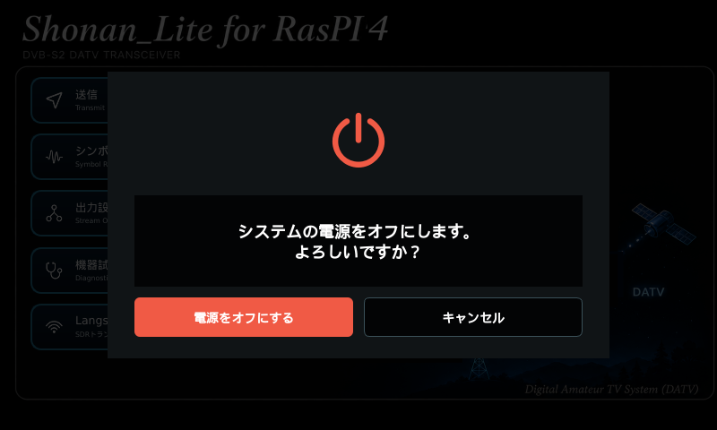 |

各画面の操作方法は、アプリ内の「ヘルプ」または操作説明書
[`pi4/docs/shonan_pi4_operation_manual.docx`](pi4/docs/shonan_pi4_operation_manual.docx)を参照。

## インストール

### 0. Raspberry Pi OSのインストール

Pi4本体に、あらかじめRaspberry Pi OSをインストールしておく。

1. PCで[Raspberry Pi Imager](https://www.raspberrypi.com/software/)を起動する。
2. 「デバイスを選択」で **Raspberry Pi 4** を選ぶ。
3. 「OSを選択」で **Raspberry Pi OS (64-bit)** を選ぶ
   (★32bit版は不可。下記「実行条件」参照)。
4. 「ストレージを選択」で書き込み先のmicroSD/NVMeを選ぶ。
5. 歯車アイコン(詳細設定)で、ホスト名・ユーザー名/パスワード・Wi-Fi・SSH有効化を
   事前設定しておくと、初回起動後すぐSSH接続できる。
6. 「書き込む」を実行し、完了後microSD/NVMeをPi4に取り付けて起動する。
7. PCから`ssh <ユーザー名>@<ホスト名>.local`で接続できることを確認する。

### 1. install.shの実行

SSH接続したPi4上で:

```sh
git clone https://github.com/kazushinjo/Shonan_lite-PI4.git
cd Shonan_lite-PI4
./pi4/scripts/install.sh          # HTTPSでclone(既定)
# ./pi4/scripts/install_ssh.sh    # GitHubにSSH鍵を登録済みならこちらでも可
```

日本語入力ビルド・受信(RX)用GNU Radio/gr-dvbs2rxビルド・Langstone V2Modifyビルドは
それぞれ省略して時間短縮できる(省略した機能は使えなくなる):

```sh
SKIP_JA_KEYBOARD=1 SKIP_GNURADIO_BUILD=1 SKIP_LANGSTONE_BUILD=1 ./pi4/scripts/install.sh
```

完了後、`shonan-gui.service`がsystemdに登録されGUIが自動起動する。あわせて
`/boot/firmware/config.txt`へ`avoid_warnings=1`(電源電圧警告アイコンの表示抑制)
を未設定なら自動で追記する(反映には再起動が必要)。

### 実行条件

一般ユーザーが実行して`install.sh`が正常完了するには、以下が必要。

- **Raspberry Pi OS 64bit(aarch64)であること**(32bit版不可)
- **`git`が事前にインストール済み**であること
- **GitHub/apt配布ミラーへのインターネット到達性**
- **sudoが使える対話的な実行**(パスワード入力に応答できるtty)
- **`patch`コマンドが使えること**

詳細な各手順の解説・トラブルシュートは
[`pi4/docs/install_script_guide.md`](pi4/docs/install_script_guide.md)
(DOCX版: `pi4/docs/install_script_guide.docx`)を参照。

## Langstone V2Modify(SDRトランシーバー)への切替

Home画面の「Langstone V2Modify」ボタンから、[kazushinjo/Langstone-V2Modify](https://github.com/kazushinjo/Langstone-V2Modify)
(VHF/UHF/マイクロ波帯SDRトランシーバー、ADALM-Pluto対応)へ切り替えられる。
Langstone V2ModifyはQt eglfsとは別に`/dev/fb0`を直接描画する独立アプリのため、
DATV送受信アプリとは同時起動できず、**reboot方式で切り替える**。

- Shonan_Lite Home画面の「Langstone V2Modify」ボタン → Pluto+とPi4が再起動 →
  Langstone V2Modifyが起動
- Langstone V2Modifyの設定メニュー内「BACK TO SHONAN_LITE」ボタン → Pluto+とPi4が
  再起動 → Shonan_Lite Home画面に戻る

Pluto+はTX/RXを繰り返した後にIIOコンテキストが詰まったような状態
(`fmcomms2_source: Unable to refill buffer`等)になることがあり、その状態の
ままアプリを切り替えると正常動作しないことがある(実機で確認)。そのため
切替のたびに必ずPluto+もrebootして毎回クリーンな状態にする。

内部的には`~/.pi4_boot_mode_langstone`マーカーファイルの有無をsystemdの
`ConditionPathExists`で判定し、`shonan-gui.service`/`langstone.service`の
どちらか一方だけがブート時に起動する。

ウォーターフォール/スペクトラム表示は幅約512px→約790pxへ拡張済み
(FFT点数自体はGNU Radio側のfft_size=512のまま、SCALEPX()マクロで描画のみ
引き伸ばしている。帯域インジケータ・目盛り・タッチ判定も含め一貫して変換)。
横方向にはSQLボタン(x=30〜130)/Volボタン(x=660〜)と同じY帯で重なり広げる
余地が無かったため、スペクトラム欄の高さ(80→55px)とウォーターフォールの
表示履歴行数(130→90行)を縮めて表示位置を上に詰め、SQL/Vol/RITいずれとも
Y方向に重ならない帯(Y=130〜295)に収めることで横方向をほぼ画面全幅まで
広げた(実機で確認、詳細は下記パッチ参照)。
統合元は`kazushinjo/Langstone-V2Modify`で、Pi 4 + DFRobot DFR0550 +
ADALM-Pluto向けの修正を含む。

`kazushinjo/Langstone-V2Modify`が更新された場合は、
[`pi4/scripts/update_langstone_from_upstream.sh`](pi4/scripts/update_langstone_from_upstream.sh)
で同梱コピーを更新できる。更新後はShonan切替用のマーカー削除・再起動処理など、
統合固有の差分を確認してから使用すること。

## 関連ドキュメント

- [`pi4/docs/install_script_guide.md`](pi4/docs/install_script_guide.md) — install.shの詳細ガイド
- [`pi4/docs/qtvirtualkeyboard_ja_build.md`](pi4/docs/qtvirtualkeyboard_ja_build.md) — 日本語オンスクリーンキーボードのビルド手順・ハマりどころ
- [`pi4/docs/shonan_pi4_operation_manual.docx`](pi4/docs/shonan_pi4_operation_manual.docx) / [`pi4/gui/manual_content.py`](pi4/gui/manual_content.py) — GUIの操作説明書(アプリ内Helpと同内容。英語のHelpは`pi4/gui/screens/manual.py`)
- [`pi4/docs/build_operation_manual.py`](pi4/docs/build_operation_manual.py) — 操作説明書(DOCX)の生成スクリプト(`python pi4/docs/build_operation_manual.py`、python-docxが必要)
- [`pi4/third_party/rpi-dvbs2-receiver-gui/`](pi4/third_party/rpi-dvbs2-receiver-gui/) — GNU Radio/gr-dvbs2rx受信フローグラフの参考実装(kazushinjo/rpi-dvbs2-receiver-guiより取り込み)
