# Shonan for RasPI4

Raspberry Pi 4 + ADALM-Pluto+によるDVB-S2 DATV送受信タッチGUIシステム。
本体は`pi4/`配下(Python/PyQt5。DFRobot DFR0550は`linuxfb`、公式DSIタッチ画面は`eglfs`で描画)。同系統の別プラットフォーム
移植版(Android/iOS)は別リポジトリ(`Shonan_Lite-android`/`Shonan_Lite-iPad`等)
で管理している。

A touch-GUI DVB-S2 DATV transceiver system using a Raspberry Pi 4 and an ADALM-Pluto+.
The application lives under `pi4/` (Python/PyQt5; drawn with `linuxfb` on the DFRobot DFR0550 and with `eglfs` on the
official DSI touch display). Ports to other platforms (Android/iOS) are maintained in separate repositories
(`Shonan_Lite-android`, `Shonan_Lite-iPad`, etc.).

> [!IMPORTANT]
> **Plutoのユーザー名(`root`)・パスワード(`analog`)はデフォルト値のまま変更しないでください。**
> 本アプリとLangstone V2Modifyは、SSHでPlutoにログインしてリブートや設定ファイルの書き込みを行っています
> (アプリ起動時・アプリ再起動・機器試験・送受信開始時・Langstone終了時)。変更するとPlutoをリブートできなくなります。
>
> **Keep the Pluto's username (`root`) and password (`analog`) at their default values.**
> This app and Langstone V2Modify log in to the Pluto via SSH to reboot it and write its settings file
> (at app start, app restart, equipment test, TX/RX start and Langstone exit). If they are changed, the Pluto cannot be rebooted.

## 主な機能 / Features

- **送信**: 周波数・シンボルレート(250k〜2 Msym/s)・FEC・変調方式(QPSK/8PSK)・出力減衰量を画面で設定し、
  UDP-TSでPluto+へ送ってPluto内蔵の変調器(`pluto_dvb`)で送信する(Plutoの設定はSSHで`/www/settings.txt`へ
  書き込み、送信先ポートは8282固定)。FECは変調方式ごとに動作する組み合わせだけを選べる
  (QPSK: 1/2・3/5・8/9、8PSK: 3/5・8/9)。H.264はPi 4内蔵のハードウェアエンコーダ(`h264_v4l2m2m`)で符号化し、
  送信映像はフルHD(1920x1080)固定。音声はカメラ内蔵マイクをAAC(モノラル16kbps)で映像と一緒に送信する(マイクが無ければ無音)。送信画面には出力減衰(dB)、
  Plutoへ送ったUDPパケット数、符号化したフレーム数を表示する。
- **映像ソース**: USBカメラ・画像ファイル(静止画を反復送信)・テストパターンから選ぶ。USBカメラは
  1280x720で取り込む(対応していればMJPEG・30fps、非対応カメラは既定の解像度)。カメラ選択時は
  「撮影」ボタンで静止画(JPG、`~/Pictures/Shonan_Lite/`)を撮り、そのまま送信画像に使える。
  コールサイン・備考を文字サイズ・文字色を選んで映像へ焼き込める(日時も表示)。
- **受信**: 外部復調機器からのUDP-TS受信、またはGNU Radio(gr-dvbs2rx)によるPi 4上でのオンデバイス復調。
- **RSSI測定**: 周波数を掃引して受信レベルをグラフ表示する。オンデバイス復調OFF(通常運用)では
  相手局の電波を測り、ON(テスト用)では自局もテストパターンで自動送信して自分の信号を測る。
- **プリセット**: 現在の設定を5件まで登録・呼び出し(プリセット1は未登録の間RFループバック試験用)。
- **機器試験**: 「全体試験」でPlutoを再起動したうえで、Pluto SDR接続・送信テスト・受信テスト・
  温度センサー(Pi 4のCPU温度)の4項目を順に確認し、TX/RXの総合結果を表示する。実行中のボタンは赤で表示する。
- **10GHz受信(LNB)**: Home画面の衛星をタップすると、Langstone V2Modifyを10236.5 MHz表示・
  Pluto受信486.5 MHz(LNB局部発振9750 MHz)の受信専用バンドで開く。Shonan_Lite(DATV)でも、
  周波数画面で「10GHz帯」を押すとLNBを使用するか確認し、使用する場合は表示周波数10.2365 GHz・
  Pluto受信486.5 MHzで受信する(受信専用、送信不可。「いいえ」なら従来どおり10180 MHz)。下記参照。
- **PA/LNAの送受信切替**: 送信中はPi 4のGPIO21(40番ピン)がHIGHになる。ESP32 W5500
  (PA_Power/PTTコントローラ)を使わなくても、この信号でPA・LNAを切り替えられる。下記参照。
- **その他**: Pluto URIの自動検出、日本語/英語表示、日本語オンスクリーンキーボード、アプリ内Help、
  起動時のアプリ選択(Shonan_Lite / Langstone)。DFRobot DFR0550(`linuxfb`)と公式DSIタッチ画面(`eglfs`)に対応。

<!-- English -->

- **Transmit**: Set the frequency, symbol rate (250k–2 Msym/s), FEC, modulation (QPSK/8PSK) and attenuation on screen,
  send UDP-TS to the Pluto+ and transmit with the Pluto's built-in modulator (`pluto_dvb`) (the Pluto settings are
  written to `/www/settings.txt` via SSH; the destination port is fixed at 8282). Only FEC rates that work with each
  modulation can be selected (QPSK: 1/2, 3/5, 8/9; 8PSK: 3/5, 8/9). H.264 is encoded with the Pi 4's hardware encoder
  (`h264_v4l2m2m`), and the transmitted video is fixed at Full HD (1920x1080). Audio from the camera's built-in microphone is sent with the video as AAC (mono, 16 kbps); silence if no microphone is found. The TX screen shows
  the attenuation (dB), the number of UDP packets sent to the Pluto and the number of encoded frames.
- **Video source**: Choose from a USB camera, an image file (a still image transmitted repeatedly) or a test pattern.
  The USB camera is captured at 1280x720 (MJPEG at 30 fps if supported, otherwise the camera's default resolution).
  With the camera selected, the "Capture" button takes a still image (JPG, `~/Pictures/Shonan_Lite/`) that can be used
  directly as the transmit image. A callsign and a note can be burned into the video with a selectable text size and
  color (the date and time are shown as well).
- **Receive**: UDP-TS reception from an external demodulator, or on-device demodulation on the Pi 4 with GNU Radio (gr-dvbs2rx).
- **RSSI measurement**: Sweeps the frequency and graphs the received level. With on-device demodulation OFF (normal
  operation) it measures the other station's signal; with it ON (for testing) the station also transmits a test
  pattern automatically and measures its own signal.
- **Presets**: Save and recall up to 5 sets of settings (preset 1 is used for the RF loopback test while it is empty).
- **Equipment test**: "Full test" reboots the Pluto and then checks the Pluto SDR connection, TX test, RX test and
  temperature sensor (Pi 4 CPU temperature) in turn, and shows the overall TX/RX result. The running button is shown in red.
- **10 GHz reception (LNB)**: Tapping the satellite on the Home screen opens Langstone V2Modify on a receive-only band
  showing 10236.5 MHz, with the Pluto receiving at 486.5 MHz (LNB local oscillator 9750 MHz). In Shonan_Lite (DATV) as
  well, pressing "10GHz Band" on the Frequency screen asks whether to use an LNB; if so, it receives with the displayed
  frequency 10.2365 GHz and the Pluto receiving at 486.5 MHz (receive only, no transmit; "No" keeps 10180 MHz as before). See below.
- **PA/LNA TX/RX switching**: GPIO21 (pin 40) of the Pi 4 goes HIGH while transmitting. The PA and LNA can be switched
  with this signal even without the ESP32 W5500 (PA_Power/PTT controller). See below.
- **Other**: Automatic Pluto URI detection, Japanese/English display, Japanese on-screen keyboard, in-app Help, and
  application selection at boot (Shonan_Lite / Langstone). Supports the DFRobot DFR0550 (`linuxfb`) and the official DSI
  touch display (`eglfs`).

## スクリーンショット / Screenshots

実機(DFR0550、800x480)の画面(2026-09-25撮影)。映像はすべてテストパターンで撮影している。
送信画面は送信中、RSSI測定はオンデバイス復調ONで「1回」実行した結果(自局のテストパターン信号)。

Screens on the device (DFR0550, 800x480, taken on 2026-09-25). All video was taken with the test pattern.
The TX screen is shown while transmitting, and RSSI measurement shows the result of a "Once" run with on-device
demodulation ON (the station's own test-pattern signal).

| Home画面 / Home | 送信画面 / TX | 受信画面 / RX | RSSI測定 / RSSI |
| --- | --- | --- | --- |
| 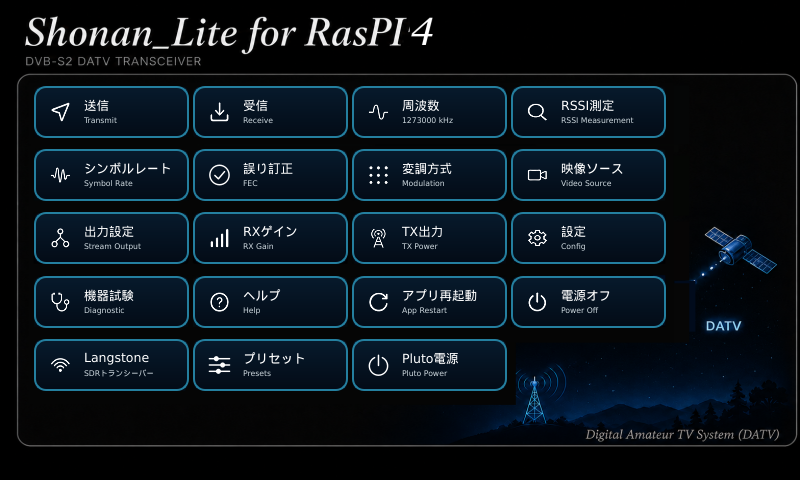 | 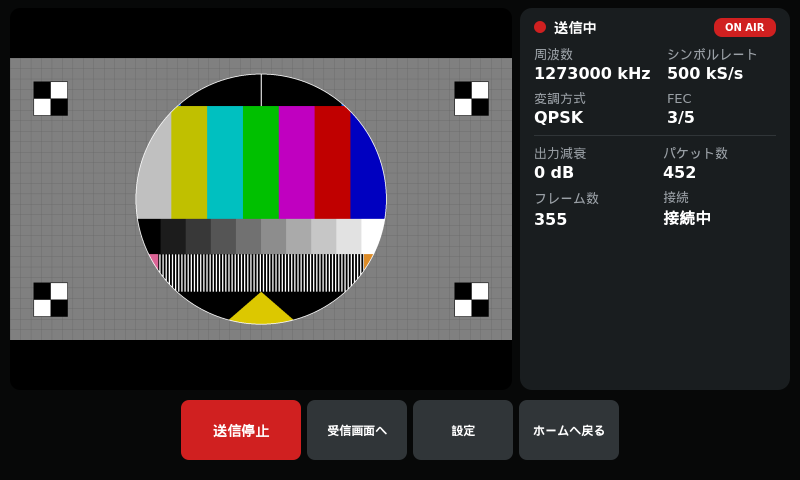 | 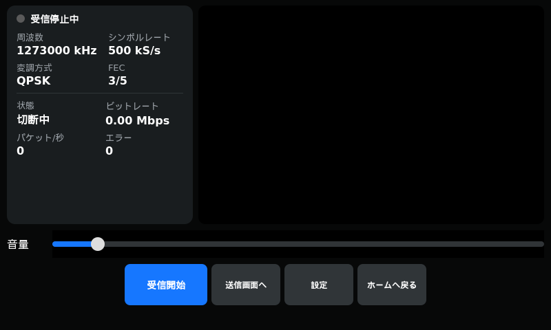 | 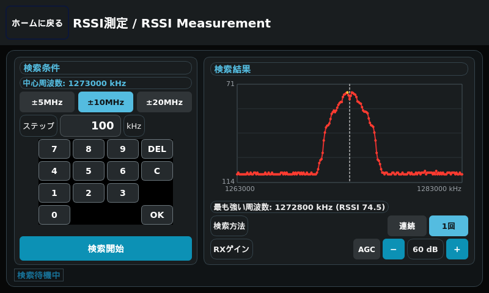 |

| 映像ソース / Video Source | 変調方式 / Modulation | 出力設定 / Stream Output | プリセット / Presets |
| --- | --- | --- | --- |
| 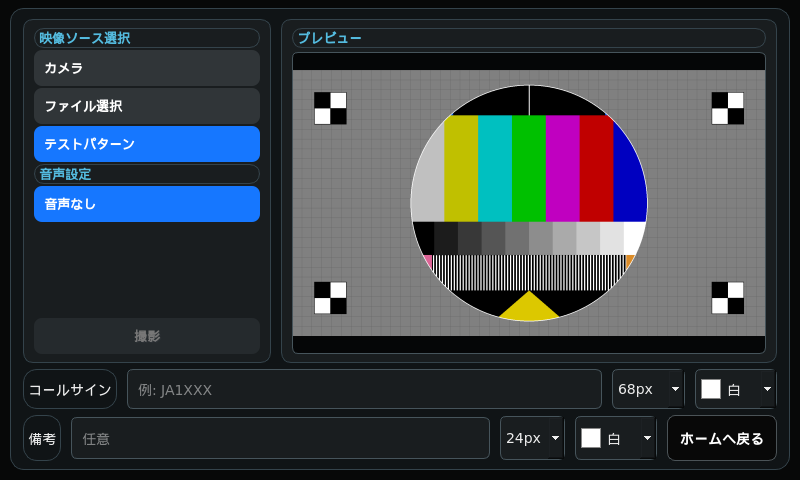 | 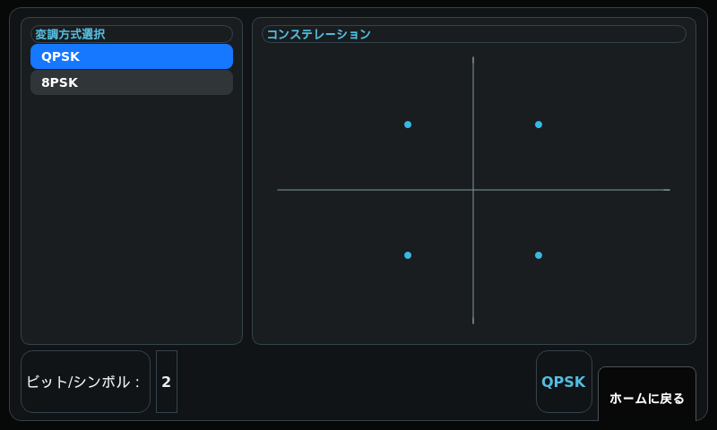 | 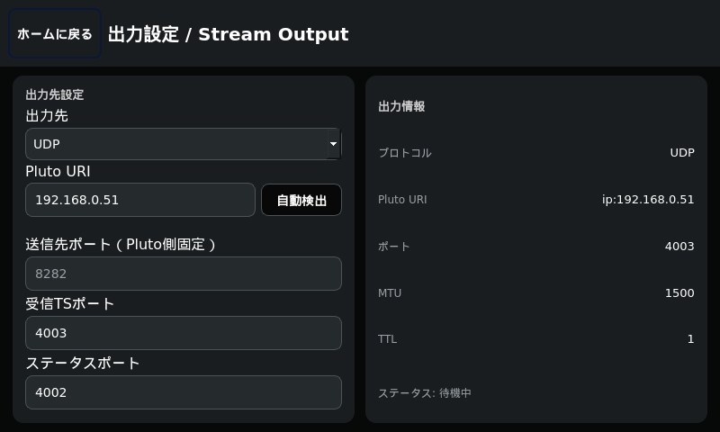 | 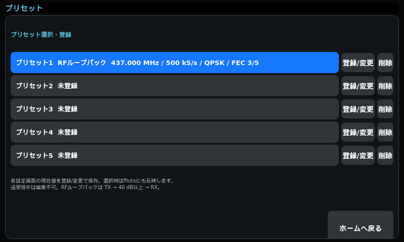 |

| 機器試験 / Diagnostic | 設定 / Config | 周波数 / Frequency | 電源オフ / Power Off |
| --- | --- | --- | --- |
| 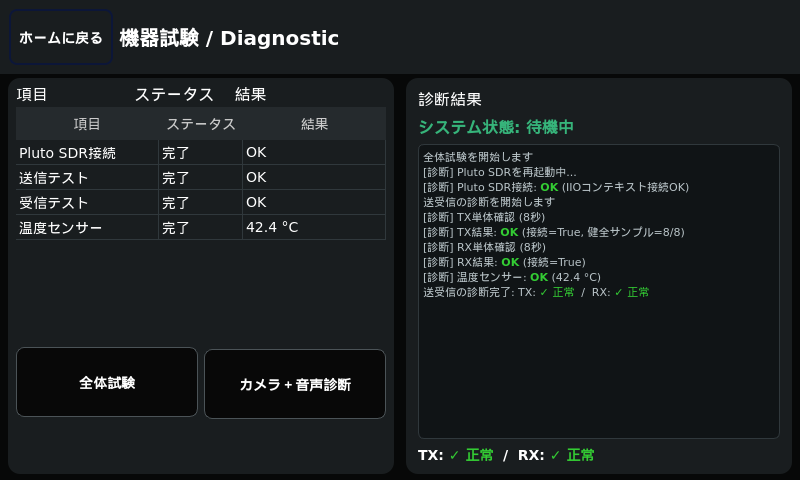 | 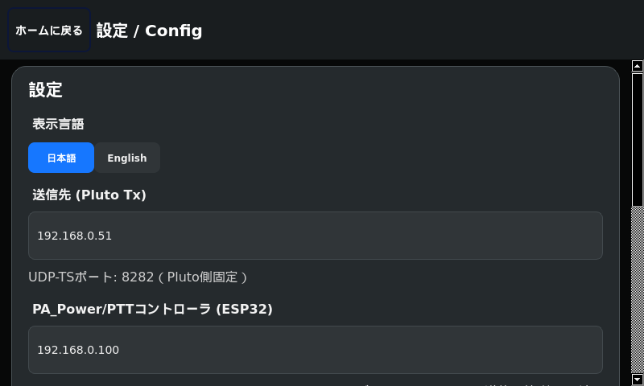 | 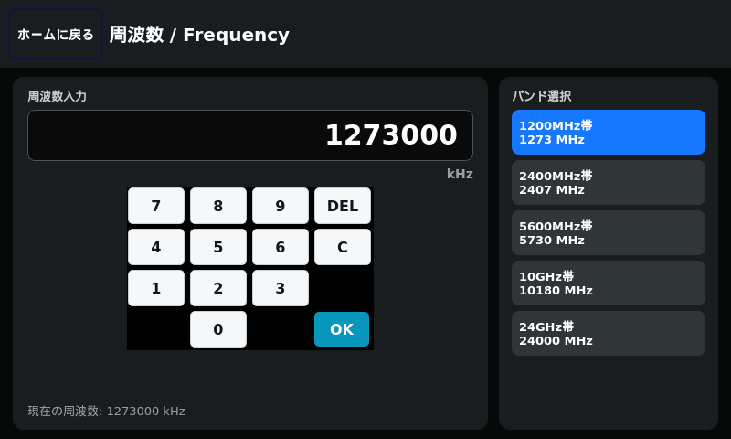 | 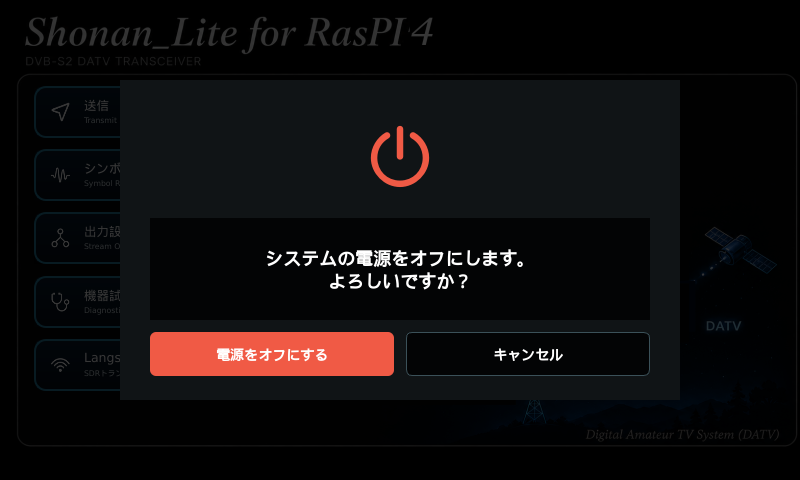 |

各画面の操作方法は、アプリ内の「ヘルプ」または操作説明書
[`pi4/docs/shonan_pi4_operation_manual.docx`](pi4/docs/shonan_pi4_operation_manual.docx)を参照。

For how to operate each screen, see the in-app "Help" or the operation manual
[`pi4/docs/shonan_pi4_operation_manual.docx`](pi4/docs/shonan_pi4_operation_manual.docx).

## インストール / Installation

### 0. Raspberry Pi OSのインストール / Installing Raspberry Pi OS

Pi4本体に、あらかじめRaspberry Pi OSをインストールしておく。

1. PCで[Raspberry Pi Imager](https://www.raspberrypi.com/software/)を起動する。
2. 「デバイスを選択」で **Raspberry Pi 4** を選ぶ。
3. 「OSを選択」で **Raspberry Pi OS (64-bit)** を選ぶ
   (★32bit版は不可。下記「実行条件」参照)。
4. 「ストレージを選択」で書き込み先のmicroSD/NVMeを選ぶ。
5. 歯車アイコン(詳細設定)で、ホスト名・ユーザー名/パスワード・Wi-Fi・SSH有効化を
   事前設定しておくと、初回起動後すぐSSH接続できる。
6. 「書き込む」を実行し、完了後microSD/NVMeをPi4に取り付けて起動する。
7. PCから`ssh <ユーザー名>@<ホスト名>.local`で接続できることを確認する。

Install Raspberry Pi OS on the Pi 4 beforehand.

1. Start [Raspberry Pi Imager](https://www.raspberrypi.com/software/) on a PC.
2. Under "Choose Device", select **Raspberry Pi 4**.
3. Under "Choose OS", select **Raspberry Pi OS (64-bit)**
   (★the 32-bit version does not work; see "Requirements" below).
4. Under "Choose Storage", select the microSD/NVMe to write to.
5. In the gear icon (advanced options), pre-configure the hostname, username/password, Wi-Fi and SSH
   so that you can connect via SSH right after the first boot.
6. Run "Write", then attach the microSD/NVMe to the Pi 4 and boot it.
7. Check that you can connect from the PC with `ssh <username>@<hostname>.local`.

### 1. install.shの実行 / Running install.sh

SSH接続したPi4上で / On the Pi 4 connected via SSH:

```sh
git clone https://github.com/kazushinjo/Shonan_lite-PI4.git
cd Shonan_lite-PI4
./pi4/scripts/install.sh          # HTTPSでclone(既定) / clone via HTTPS (default)
# ./pi4/scripts/install_ssh.sh    # GitHubにSSH鍵を登録済みならこちらでも可 / or this if your SSH key is registered on GitHub
```

日本語入力ビルド・受信(RX)用GNU Radio/gr-dvbs2rxビルド・Langstone V2Modifyビルドは
それぞれ省略して時間短縮できる(省略した機能は使えなくなる):

The Japanese input build, the GNU Radio/gr-dvbs2rx build for RX and the Langstone V2Modify build can each be
skipped to save time (the skipped features will not be available):

```sh
SKIP_JA_KEYBOARD=1 SKIP_GNURADIO_BUILD=1 SKIP_LANGSTONE_BUILD=1 ./pi4/scripts/install.sh
```

★OSを新規インストールした直後の初回実行では、DFR0550をfirmwareのレガシーDSI表示で
動かすため、`install.sh`が最初に`/boot/firmware/config.txt`の`dtoverlay=vc4-kms-v3d`・
`display_auto_detect=1`・`disable_fw_kms_setup=1`をコメントアウトし、`dtparam=i2c_arm=on`を
追記して終了する。案内に従ってPi4を再起動(`sudo reboot`)し、同じコマンドを再実行すると
ビルドへ進む(KMS有効のままビルドすると画面・タッチが使えないうえ、実機が再起動して
パッケージが破損することを確認している)。

★On the first run right after a fresh OS install, to drive the DFR0550 with the firmware's legacy DSI display,
`install.sh` first comments out `dtoverlay=vc4-kms-v3d`, `display_auto_detect=1` and `disable_fw_kms_setup=1` in
`/boot/firmware/config.txt`, adds `dtparam=i2c_arm=on`, and exits. Reboot the Pi 4 as instructed (`sudo reboot`) and
run the same command again to proceed to the build (building with KMS enabled leaves the display and touch unusable,
and we confirmed that the device reboots and packages get corrupted).

完了後、`shonan-gui.service`がsystemdに登録されGUIが自動起動する。あわせて
`/boot/firmware/config.txt`へ`avoid_warnings=1`(電源電圧警告アイコンの表示抑制)
を未設定なら自動で追記する(反映には再起動が必要)。

When finished, `shonan-gui.service` is registered with systemd and the GUI starts automatically. It also adds
`avoid_warnings=1` (suppresses the under-voltage warning icon) to `/boot/firmware/config.txt` if not already set
(a reboot is required for it to take effect).

### 実行条件 / Requirements

一般ユーザーが実行して`install.sh`が正常完了するには、以下が必要。

- **Raspberry Pi OS 64bit(aarch64)であること**(32bit版不可)
- **`git`が事前にインストール済み**であること
- **GitHub/apt配布ミラーへのインターネット到達性**
- **sudoが使える対話的な実行**(パスワード入力に応答できるtty)
- **`patch`コマンドが使えること**

For `install.sh` to complete successfully when run as a normal user, the following are required.

- **Raspberry Pi OS 64-bit (aarch64)** (the 32-bit version does not work)
- **`git` installed beforehand**
- **Internet access to GitHub and the apt mirrors**
- **Interactive execution with sudo** (a tty that can answer the password prompt)
- **The `patch` command available**

詳細な各手順の解説・トラブルシュートは
[`pi4/docs/install_script_guide.md`](pi4/docs/install_script_guide.md)
(DOCX版: `pi4/docs/install_script_guide.docx`)を参照。

For a detailed explanation of each step and troubleshooting, see
[`pi4/docs/install_script_guide.md`](pi4/docs/install_script_guide.md)
(DOCX version: `pi4/docs/install_script_guide.docx`).

## オプション: ESP32 W5500(PA_Power/PTTコントローラ) / Option: ESP32 W5500 (PA_Power/PTT controller)

ESP32とW5500(有線LAN)で、PA等の12 V電源とPTTをLAN経由でON/OFFするオプションの制御基板。
使わなくてもShonan_Liteは動作する(PTTだけなら下記のPi 4 GPIO21で切替できる)。
ファームウェアは[`hardware/W5500_PA_PTT_Control/W5500_PA_PTT_Control.ino`](hardware/W5500_PA_PTT_Control/W5500_PA_PTT_Control.ino)、
基板は[`hardware/W5500_PA_PTT_Control/kicad/`](hardware/W5500_PA_PTT_Control/kicad/)(KiCad、Rev.1.0)。基板とファームウェアはShonan_Lite-RasPI5版と共通。

| 基板の3D表示 / 3D view of the board | 基板レイアウト(KiCad) / PCB layout (KiCad) | ケース(OpenSCAD) / Case (OpenSCAD) |
| --- | --- | --- |
| 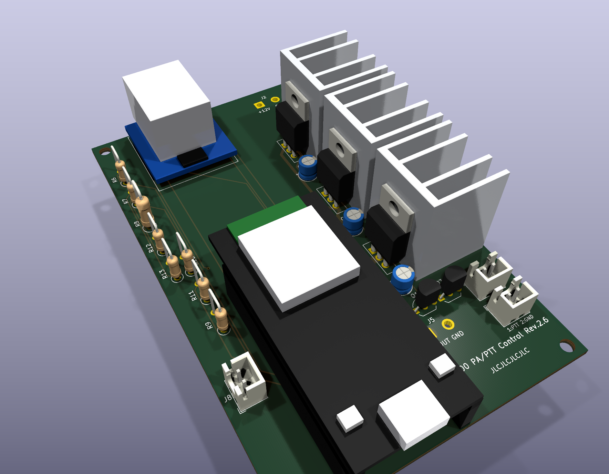 |  | 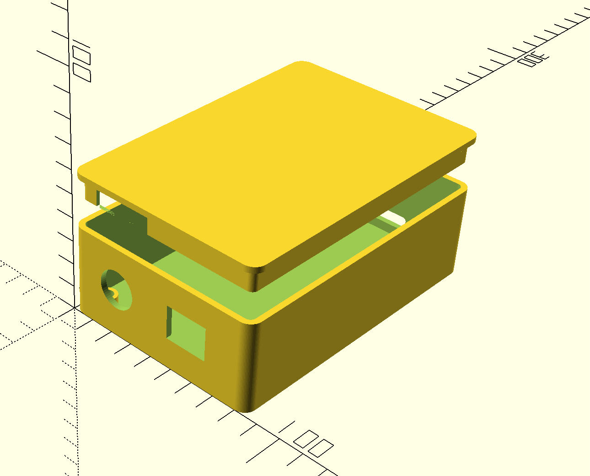 |

| 項目<br>Item | 内容<br>Details |
| --- | --- |
| 構成<br>Configuration | Freenove ESP32-WROOM-32E DevKitC(ソケットに差し込み)+W5500 Lite(SPI接続)<br>Freenove ESP32-WROOM-32E DevKitC (plugged into a socket) + W5500 Lite (SPI) |
| 12 V電源<br>12 V power | 2SJ334(Pチャネル MOSFET)のハイサイドスイッチでJ5の12 V出力をON/OFF。放熱器付きで目安は約7 Aまで<br>J5's 12 V output is switched by a 2SJ334 (P-channel MOSFET) high-side switch; with its heatsink, up to about 7 A |
| PTT<br>PTT | 2SC1815で無線機のPTT端子をGNDへ落とす(J6)<br>A 2SC1815 pulls the radio's PTT line to GND (J6) |
| 電源入力<br>Power input | +12 V(13.8 V系)をJ2へ。L7805で5 V(ESP32)、TA48033Sで3.3 V(W5500)を作る<br>+12 V (13.8 V class) to J2; an L7805 makes 5 V (ESP32) and a TA48033S makes 3.3 V (W5500) |
| 表示LED<br>Indicator LEDs | 外付け。J7=12 V出力(赤)、J8=12 V入力(緑)(JST XH)<br>External; J7 = 12 V output (red), J8 = 12 V input (green) (JST XH) |
| ネットワーク<br>Network | 固定IP(初期値`192.168.0.100`)。ブラウザで`http://<IP>/`を開くと手動でON/OFFでき、`http://<IP>/config`でIPや遅延時間を変更できる<br>Static IP (default `192.168.0.100`); open `http://<IP>/` in a browser to switch ON/OFF manually, and `http://<IP>/config` to change the IP and delays |
| 基板<br>Board | 72×115 mm、4層(内層はGNDと+12Vのベタ)、部品はすべてスルーホール。JLCPCBの発注データは[`fabrication/jlcpcb/`](hardware/W5500_PA_PTT_Control/fabrication/jlcpcb/)<br>72×115 mm, 4 layers (inner layers are GND and +12 V planes), all through-hole parts. JLCPCB order data is in [`fabrication/jlcpcb/`](hardware/W5500_PA_PTT_Control/fabrication/jlcpcb/) |
| ケース<br>Case | OpenSCAD(LAN_PTT.scad)、内寸80×120×35 mm。前面にRJ45の角穴と+12V入力の丸型コネクタ、背面にUSBの穴と12 V出力・PTTの丸型コネクタ<br>OpenSCAD (LAN_PTT.scad), inside 80×120×35 mm. RJ45 opening and +12 V input circular connector on the front; USB opening and 12 V output/PTT circular connector on the back |

Shonan_Liteでの使い方:

- 設定画面の「PA_Power/PTTコントローラ (ESP32)」で「ESP32 W5500を使用する」をONにし、ESP32のIPアドレスを入力する。
- アプリの起動/終了に連動して12 V電源(Pluto含む)を、送信開始/終了に連動してPTTを自動でON/OFFする(Langstone V2Modifyの送信でもPTTが切り替わる)。
- ホーム画面の「Pluto電源」カードで、12 V系統を手動で電源サイクル(OFF→3秒待機→ON)できる。

詳しくは[仕様書](hardware/W5500_PA_PTT_Control/docs/W5500_PA_PTT_Control_仕様書.md)と
[接続一覧](hardware/W5500_PA_PTT_Control/docs/MCU1_J1_W5500_接続一覧.md)を参照(どちらも日英併記。Word版・PDF版も同じフォルダにある)。
回路図: [`w5500-esp32.pdf`](hardware/W5500_PA_PTT_Control/kicad/w5500-esp32.pdf)、
実装図: [`w5500-esp32_実装図_部品番号.pdf`](hardware/W5500_PA_PTT_Control/fabrication/assembly/w5500-esp32_実装図_部品番号.pdf)。

> [!NOTE]
> ESP32への書き込みと起動は確認済み。12 V電源・PTTの駆動回路と無線機をつないだ実地試験はまだ行っていない。

<!-- English -->

An optional control board that uses an ESP32 and a W5500 (wired LAN) to switch the 12 V power for the PA etc.
and the PTT ON/OFF over the LAN. Shonan_Lite works without it (PTT alone can be switched with the Pi 4 GPIO21 below).
The firmware is [`hardware/W5500_PA_PTT_Control/W5500_PA_PTT_Control.ino`](hardware/W5500_PA_PTT_Control/W5500_PA_PTT_Control.ino)
and the board is in [`hardware/W5500_PA_PTT_Control/kicad/`](hardware/W5500_PA_PTT_Control/kicad/) (KiCad, Rev.1.0). The board and firmware are shared with the
Shonan_Lite-RasPI5 edition.

How to use it with Shonan_Lite:

- On the Settings screen, turn on "Use ESP32 W5500" under "PA_Power/PTT Controller (ESP32)" and enter the ESP32's IP address.
- The 12 V power (including the Pluto) is switched ON/OFF with app start/exit, and the PTT with TX start/stop (PTT also follows TX in Langstone V2Modify).
- The "Pluto Power" card on the Home screen power-cycles the 12 V line manually (OFF → wait 3 s → ON).

For details, see the [specification](hardware/W5500_PA_PTT_Control/docs/W5500_PA_PTT_Control_仕様書.md) and the
[connection list](hardware/W5500_PA_PTT_Control/docs/MCU1_J1_W5500_接続一覧.md) (both in Japanese and English;
Word and PDF versions are in the same folder).
Schematic: [`w5500-esp32.pdf`](hardware/W5500_PA_PTT_Control/kicad/w5500-esp32.pdf);
assembly drawing: [`w5500-esp32_実装図_部品番号.pdf`](hardware/W5500_PA_PTT_Control/fabrication/assembly/w5500-esp32_実装図_部品番号.pdf).

> [!NOTE]
> Flashing and booting the ESP32 have been confirmed. A field test with the 12 V power/PTT drive circuits
> connected to a radio has not been done yet.

## PA/LNAの送受信切替(ESP32 W5500なしでも可) / PA/LNA TX/RX switching (possible without ESP32 W5500)

ESP32 W5500(PA_Power/PTTコントローラ、[`hardware/W5500_PA_PTT_Control`](hardware/W5500_PA_PTT_Control))は
使わなくても、RasPI4からのPTT ON信号でPA・LNAの送受信切替を制御できる。

| 項目<br>Item | 内容<br>Details |
| --- | --- |
| 出力ピン<br>Output pin | Pi 4 GPIO21(40番ピン)、GNDは39番ピン<br>Pi 4 GPIO21 (pin 40), GND on pin 39 |
| 論理<br>Logic | 送信中HIGH(3.3 V)、受信中LOW<br>HIGH (3.3 V) while transmitting, LOW while receiving |
| 対象<br>Applies to | Shonan_Liteの送信・Langstone V2Modifyの送信(Langstone標準のTx Output)のどちらも同じピン<br>Both Shonan_Lite TX and Langstone V2Modify TX (Langstone's standard Tx Output) use the same pin |

- GPIO21は3.3 Vロジックで電流を取れないため、トランジスタやリレードライバ等でバッファしてから
  PA・LNA(同軸リレー等)を駆動すること。
- Shonan_Liteは送信開始時(映像送出の前)にHIGH、送信停止時とアプリ起動時にLOWにする
  ([`pi4/gui/backend.py`](pi4/gui/backend.py)の`_set_pi_tx_gpio()`、`pinctrl`で出力)。
- ESP32 W5500を併用する場合は、送信の開始/停止に連動してESP32のPTT出力(J6)も同時に切り替わる
  (`/tx?state=on|off`)。12 V電源のON/OFFとホーム画面の「Pluto電源」カードはESP32 W5500が必要。
  ESP32を使うかどうかは設定画面の「ESP32 W5500を使用する」で選ぶ(OFFにしてもIPアドレスは保持される)。

<!-- English -->

The PA and LNA can be switched between TX and RX by the PTT ON signal from the RasPI4, even without the
ESP32 W5500 (PA_Power/PTT controller, [`hardware/W5500_PA_PTT_Control`](hardware/W5500_PA_PTT_Control)).

- GPIO21 is a 3.3 V logic output that cannot supply current. Buffer it with a transistor, relay driver or
  similar before driving the PA and LNA (coax relays, etc.).
- Shonan_Lite sets it HIGH when TX starts (before the video is sent) and LOW when TX stops and at app startup
  (`_set_pi_tx_gpio()` in [`pi4/gui/backend.py`](pi4/gui/backend.py), driven with `pinctrl`).
- When the ESP32 W5500 is also used, its PTT output (J6) switches together with TX start/stop (`/tx?state=on|off`).
  Switching the 12 V power ON/OFF and the "Pluto Power" card on the Home screen require the ESP32 W5500. Whether to use
  the ESP32 is selected with "Use ESP32 W5500" on the Settings screen (the IP address is kept even when OFF).

## Langstone V2Modify(SDRトランシーバー)への切替 / Switching to Langstone V2Modify (SDR transceiver)

Home画面の「Langstone」カードから、`kazushinjo/Langstone-V2Modify`
(VHF/UHF/マイクロ波帯SDRトランシーバー、ADALM-Pluto対応)へ切り替えられる。
Langstone V2ModifyはQt eglfsとは別に`/dev/fb0`を直接描画する独立アプリのため、
DATV送受信アプリとは同時起動できない。`shonan-gui.service`/`langstone.service`/
`shonan-boot-menu.service`はsystemdの`Conflicts=`で互いに排他制御されるため、
Pi4自体は再起動せず、サービスを直接切り替える。

- Shonan_Lite Home画面の「Langstone」カード → DATVの送受信を止めてLangstone V2Modifyが起動
- Langstone V2Modifyの設定メニュー内「GOTO SHONAN_LITE」ボタン → Shonan_Lite Home画面に戻る

切替時間を短くするため、切替のときはPluto+を再起動しない(Pi5版で、再起動しなくても両アプリの
送受信が正常に動くことを確認済み)。ただしLangstoneは受信中に送信LOを止めたまま終了するため、
戻るときはLangstone側・Shonan_Lite側の両方で送信LOを元に戻す。切替以外(電源投入時・アプリ再起動・
Langstoneを「GOTO SHONAN_LITE」以外で終了したとき)は、従来どおりPluto+を再起動する。
Langstone側は`/tmp/langstone_goto_shonan`、Shonan_Lite側は`/tmp/shonan_switch_from_langstone`
の印で切替かどうかを判断する。

Langstone V2Modify is a standalone app that draws directly to `/dev/fb0` separately from Qt eglfs, so it cannot run at
the same time as the DATV app. `shonan-gui.service`, `langstone.service` and `shonan-boot-menu.service` are mutually
exclusive through systemd's `Conflicts=`, so the services are switched directly without rebooting the Pi 4.

- "Langstone" card on the Shonan_Lite Home screen → DATV TX/RX is stopped and Langstone V2Modify starts
- "GOTO SHONAN_LITE" button in the Langstone V2Modify settings menu → returns to the Shonan_Lite Home screen

To shorten the switching time, the Pluto+ is not rebooted when switching (confirmed on the Pi 5 version that both apps
transmit and receive normally without a reboot). However, Langstone exits with the TX LO powered down while receiving,
so the TX LO is restored on both the Langstone side and the Shonan_Lite side when returning. Other than when switching
(power-up, app restart, or when Langstone exits other than via "GOTO SHONAN_LITE"), the Pluto+ is rebooted as before.
The Langstone side uses the `/tmp/langstone_goto_shonan` marker and the Shonan_Lite side uses
`/tmp/shonan_switch_from_langstone` to tell whether it is a switch.

内部的には`~/.pi4_boot_mode_langstone`マーカーファイルの有無をsystemdの
`ConditionPathExists`で判定し、`shonan-gui.service`/`langstone.service`の
どちらを起動すべきかを決める。

Internally, systemd's `ConditionPathExists` checks for the `~/.pi4_boot_mode_langstone` marker file to decide whether
`shonan-gui.service` or `langstone.service` should start.

ウォーターフォール/スペクトラム表示は幅約512px→約790pxへ拡張済み
(FFT点数自体はGNU Radio側のfft_size=512のまま、SCALEPX()マクロで描画のみ
引き伸ばしている。帯域インジケータ・目盛り・タッチ判定も含め一貫して変換)。
横方向にはSQLボタン(x=30〜130)/Volボタン(x=660〜)と同じY帯で重なり広げる
余地が無かったため、スペクトラム欄の高さ(80→55px)とウォーターフォールの
表示履歴行数(130→90行)を縮めて表示位置を上に詰め、SQL/Vol/RITいずれとも
Y方向に重ならない帯(Y=130〜295)に収めることで横方向をほぼ画面全幅まで
広げた(実機で確認)。
統合元は`kazushinjo/Langstone-V2Modify`で、Pi 4 + DFRobot DFR0550 +
ADALM-Pluto向けの修正を含む。

The waterfall/spectrum display has been widened from about 512 px to about 790 px (the number of FFT points stays at
fft_size=512 on the GNU Radio side; only the drawing is stretched by the SCALEPX() macro, applied consistently to the
bandwidth indicator, scale and touch detection). Since there was no room to widen it horizontally in the same Y band as
the SQL button (x=30–130) and Vol button (x=660–), the spectrum area height (80 → 55 px) and the number of waterfall
history rows (130 → 90) were reduced and the display moved up into a band (Y=130–295) that does not overlap SQL/Vol/RIT
vertically, which allows it to extend to nearly the full screen width (confirmed on the device). It is integrated from
`kazushinjo/Langstone-V2Modify` and includes fixes for the Pi 4 + DFRobot DFR0550 + ADALM-Pluto.

`kazushinjo/Langstone-V2Modify`が更新された場合は、
[`pi4/scripts/update_langstone_from_upstream.sh`](pi4/scripts/update_langstone_from_upstream.sh)
で同梱コピーを更新できる。更新後はShonan切替用のマーカー処理・受信専用バンド(`bandRxOnly`)など、
統合固有の差分を確認してから使用すること。

When `kazushinjo/Langstone-V2Modify` is updated, the bundled copy can be updated with
[`pi4/scripts/update_langstone_from_upstream.sh`](pi4/scripts/update_langstone_from_upstream.sh).
After updating, check the integration-specific differences, such as the Shonan switching markers and the receive-only
band (`bandRxOnly`), before use.

### 10GHz受信(LNB) — Home画面の衛星をタップ / 10 GHz reception (LNB) — tap the satellite on the Home screen

Home画面の背景右側の衛星をタップすると、Langstone V2Modifyを**10GHz受信用のバンド**で
開く(普通の「Langstone」カードと同じく、Plutoは再起動しない)。アンテナ側で
LNB(局部発振9750 MHz)を使い、10 GHz帯を486.5 MHzへ下げて受信する前提。

Tapping the satellite on the right side of the Home screen background opens Langstone V2Modify on a
**band for 10 GHz reception** (as with the normal "Langstone" card, the Pluto is not rebooted).
This assumes an LNB (local oscillator 9750 MHz) on the antenna side that converts the 10 GHz band down to 486.5 MHz.

| 項目<br>Item | 値<br>Value |
| --- | --- |
| 画面の表示周波数<br>Displayed frequency | 10236.500 MHz(10.2365 GHz)<br>10236.500 MHz (10.2365 GHz) |
| Plutoの受信周波数<br>Pluto receive frequency | 486.5 MHz(= 10236.5 − 9750) |
| 受信オフセット<br>Receive offset | −9750 MHz(LNB 局部発振 9750 MHz)<br>−9750 MHz (LNB local oscillator 9750 MHz) |
| 送信<br>Transmit | **不可**(受信専用)<br>**Not possible** (receive only) |

- Langstoneの24バンドのうち、通常使われない最後のバンド(番号23、画面上は24番目)を
  このために使う。衛星をタップするたびに、Shonan_Liteが`~/Langstone/Langstone_Pluto.conf`
  のこのバンドを上の値に設定し直してから開く([`pi4/gui/langstone_config.py`](pi4/gui/langstone_config.py))。
- 486.5 MHzはアマチュアバンド外のため、このバンドは**受信専用**
  (設定ファイルの`bandRxOnly23 1`、Langstone側の改造)。画面のPTT・ハードウェアPTT・
  CWキー・ビーコンのいずれでも送信せず、PA_Power/PTTコントローラも送信に切り替えない。
  PTTボタンは灰色の「RX ONLY」表示になり、Plutoの送信LOも停止させる。
- 普通の「Langstone」カードで開いたときは、衛星から開く前に使っていたバンドに戻して開く
  (Langstone上で別のバンドに切り替えていた場合は、そのバンドのまま)。
- Shonan_Lite(DATV)で10GHzをLNB受信する場合は、衛星ではなく周波数画面の「10GHz帯」を押し、
  「LNBを使用しますか?」で「はい」を選ぶ(表示10.2365 GHz、Pluto受信486.5 MHz、受信専用で送信不可。
  受信画面・RSSI測定もPluto受信周波数で動作する)。他のバンドを選ぶとLNBは解除される。
- LNBへの電源供給(同軸経由のバイアスT、12〜18 V)はShonan_Lite/Langstoneでは扱わない。
  別途用意すること。

<!-- English -->

- Of Langstone's 24 bands, the last one, which is not normally used (number 23, the 24th on screen), is used for this.
  Every time the satellite is tapped, Shonan_Lite resets this band in `~/Langstone/Langstone_Pluto.conf` to the values
  above before opening ([`pi4/gui/langstone_config.py`](pi4/gui/langstone_config.py)).
- Because 486.5 MHz is outside the amateur bands, this band is **receive only** (`bandRxOnly23 1` in the configuration
  file, a modification on the Langstone side). It does not transmit from the on-screen PTT, hardware PTT, CW key or
  beacon, and does not switch the PA_Power/PTT controller to transmit. The PTT button is shown grayed out as "RX ONLY",
  and the Pluto's TX LO is also stopped.
- When opened from the normal "Langstone" card, it returns to the band that was in use before opening from the
  satellite (if you switched to another band in Langstone, it stays on that band).
- To receive 10 GHz via an LNB in Shonan_Lite (DATV), press "10GHz Band" on the Frequency screen (not the satellite)
  and answer "Yes" to "Use an LNB?" (displayed 10.2365 GHz, Pluto RX 486.5 MHz, receive only with no transmit; the RX
  screen and RSSI measurement also use the Pluto RX frequency). Selecting another band cancels the LNB.
- Power for the LNB (bias-T over the coax, 12–18 V) is not handled by Shonan_Lite/Langstone. Provide it separately.

## 関連ドキュメント / Related documents

- [`pi4/docs/install_script_guide.md`](pi4/docs/install_script_guide.md) — install.shの詳細ガイド / Detailed guide to install.sh(英語版 / English: [`install_script_guide_en.md`](pi4/docs/install_script_guide_en.md))
- [`pi4/docs/qtvirtualkeyboard_ja_build.md`](pi4/docs/qtvirtualkeyboard_ja_build.md) — 日本語オンスクリーンキーボードのビルド手順・ハマりどころ / Build steps and pitfalls for the Japanese on-screen keyboard
- [`pi4/docs/shonan_pi4_operation_manual.docx`](pi4/docs/shonan_pi4_operation_manual.docx) / [`pi4/gui/manual_content.py`](pi4/gui/manual_content.py) — GUIの操作説明書(アプリ内Helpと同内容。英語のHelpは`pi4/gui/screens/manual.py`) / Operation manual for the GUI (same content as the in-app Help; the English Help is in `pi4/gui/screens/manual.py`)
- [`pi4/docs/build_operation_manual.py`](pi4/docs/build_operation_manual.py) — 操作説明書(DOCX)の生成スクリプト(`python pi4/docs/build_operation_manual.py`、python-docxが必要) / Script that generates the operation manual (DOCX) (requires python-docx)
- [`hardware/W5500_PA_PTT_Control/docs/W5500_PA_PTT_Control_仕様書.md`](hardware/W5500_PA_PTT_Control/docs/W5500_PA_PTT_Control_仕様書.md) — ESP32 W5500(PA_Power/PTTコントローラ)の仕様書 / Specification of the ESP32 W5500 (PA_Power/PTT controller)(日英併記 / Japanese and English)
  - 仕様書・接続一覧のWord版・PDF版は[`hardware/W5500_PA_PTT_Control/docs/tools/build_docs.py`](hardware/W5500_PA_PTT_Control/docs/tools/build_docs.py)でMarkdownから作る(macOSで実行) / The Word and PDF versions of the specification and connection list are generated from Markdown with this script (run on macOS)
- [`hardware/W5500_PA_PTT_Control/docs/MCU1_J1_W5500_接続一覧.md`](hardware/W5500_PA_PTT_Control/docs/MCU1_J1_W5500_接続一覧.md) — ESP32・W5500の接続一覧 / Connection list of the ESP32 and W5500(日英併記 / Japanese and English)
- [`hardware/W5500_PA_PTT_Control/kicad/`](hardware/W5500_PA_PTT_Control/kicad/) — ESP32 W5500制御基板のKiCad回路図・基板 / KiCad schematic and PCB of the ESP32 W5500 control board
- [`pi4/third_party/rpi-dvbs2-receiver-gui/`](pi4/third_party/rpi-dvbs2-receiver-gui/) — GNU Radio/gr-dvbs2rx受信フローグラフの参考実装(kazushinjo/rpi-dvbs2-receiver-guiより取り込み) / Reference implementation of the GNU Radio/gr-dvbs2rx receive flowgraph (imported from kazushinjo/rpi-dvbs2-receiver-gui)

## 免責事項 / Disclaimer

1. **無保証・自己責任 / No warranty; use at your own risk**  
   本ソフトウェアは現状のまま(AS IS)で提供され、動作、品質、特定の目的への適合性を含め、いかなる保証もありません。本ソフトウェアの使用または使用できないことによって生じた、機器の破損、データの消失、電波障害、その他一切の損害について、開発者は責任を負いません。ご自身の責任においてご利用ください。  
   This software is provided "AS IS" without warranty of any kind, including any warranty of operation, quality or fitness for a particular purpose. The developers accept no liability for any damage arising from the use of, or inability to use, this software, including damage to equipment, loss of data and radio interference. Use it at your own risk.
2. **免許と法令の順守 / Licensing and compliance with the law**  
   本ソフトウェアは、アマチュア無線のDATV(デジタルATV)実験のための送受信ソフトウェアです。電波を送信するには、運用する国・地域の法令に基づく免許が必要です(日本国内ではアマチュア局の免許)。周波数、空中線電力、電波の型式、運用できる範囲などの法令(日本国内では電波法および関係規則)を守ってください。免許のない送信や、免許の範囲を超えた送信は、法令違反となることがあります。本ソフトウェアは、設定された周波数・出力・変調方式が法令に適合していることを確認も保証もしません。送信の内容と結果は、すべて使用者の責任です。  
   This software is for amateur-radio DATV (digital ATV) experiments. Transmitting requires a license under the laws of the country or region where you operate (in Japan, an amateur station license). Observe the applicable laws on frequency, transmitter power, emission type and permitted operation (in Japan, the Radio Act and related regulations). Transmitting without a license, or beyond the scope of your license, may violate the law. This software neither checks nor guarantees that the configured frequency, power and modulation comply with the law. You are solely responsible for what you transmit and for the results.
3. **機器の取り扱い / Handling of equipment**  
   PlutoのTXとRXの接続、外部アンプ(PA)・アッテネータ・アンテナの接続、送信出力の設定、GPIO21やPA_Power/PTTコントローラ(ESP32 W5500)の12 V電源・PTTの配線を誤ると、機器を破損したり、他の無線局へ障害を与えたりするおそれがあります。機器の仕様を確認し、使用者の責任で行ってください。特に、TXをRXへ直接接続せず、40 dB以上の減衰器を介してください。  
   Wrong connections between the Pluto's TX and RX, wrong external amplifier (PA), attenuator or antenna connections, wrong transmit power settings, or wrong wiring of GPIO21 or of the 12 V power/PTT of the PA_Power/PTT controller (ESP32 W5500) may damage equipment or interfere with other stations. Check the specifications of your equipment and do this at your own responsibility. In particular, never connect TX directly to RX; use an attenuator of 40 dB or more.
4. **第三者ソフトウェアとライセンス / Third-party software and license**  
   本ソフトウェアは、GNU Radio、gr-dvbs2rx、libiio、FFmpeg、Qt(PyQt5・Qt Virtual Keyboard)、Langstone V2(Langstone-V2Modify)などの第三者ソフトウェアを利用・同梱します。それぞれのライセンスに従います。本ソフトウェア自体は GNU General Public License v3.0(GPLv3)の下で提供されます(下記「License」参照)。  
   This software uses and bundles third-party software such as GNU Radio, gr-dvbs2rx, libiio, FFmpeg, Qt (PyQt5, Qt Virtual Keyboard) and Langstone V2 (Langstone-V2Modify), each under its own license. This software itself is provided under the GNU General Public License v3.0 (GPLv3); see "License" below.
5. **動作について / About behavior**  
   ご使用のRaspberry Pi・環境によって動作が異なる場合や、未発見の不具合が含まれる可能性があります。  
   Behavior may differ depending on your Raspberry Pi and environment, and undiscovered defects may remain.

## クレジット / Credits

- 受信部の方式考案・受信部原システム設計: 山崎慎慈氏(JE1BTA)
  rpi-dvbs2-receiver-guiの設計に基づきます
- 受信部安定化調査修正・再捕捉修正・本アプリ開発: 真城和一
- 本アプリは、Dave Crump氏(G8GKQ)が開発したDATV送受信機プロジェクト「Portsdown」に啓発され、開発したものです。同氏の先駆的な取り組みに感謝いたします。
- Langstone V2(SDRトランシーバー): Colin Durbridge氏(G4EML)の[g4eml/Langstone-V2](https://github.com/g4eml/Langstone-V2)
  (Pi 4 + DFRobot DFR0550 + ADALM-Pluto向けに改造した`kazushinjo/Langstone-V2Modify`を
  [`pi4/third_party/Langstone-V2Modify/`](pi4/third_party/Langstone-V2Modify/)に同梱)

<!-- English -->

- Reception method and original reception system design: Shinji Yamazaki (JE1BTA),
  based on the design of rpi-dvbs2-receiver-gui
- Reception stability investigation and fixes, re-acquisition fixes, and development of this app: Kazuichi Shinjo
- This application was developed inspired by "Portsdown", the DATV transceiver project created by Dave Crump (G8GKQ). We extend our deep gratitude for his pioneering work.
- Langstone V2 (SDR transceiver): [g4eml/Langstone-V2](https://github.com/g4eml/Langstone-V2) by Colin Durbridge (G4EML)
  (`kazushinjo/Langstone-V2Modify`, modified for the Pi 4 + DFRobot DFR0550 +
  ADALM-Pluto, is bundled in [`pi4/third_party/Langstone-V2Modify/`](pi4/third_party/Langstone-V2Modify/))

## License

本ソフトウェアはGNU General Public License v3.0(GPLv3)の下で提供されます。
ライセンス全文: [LICENSE](LICENSE)

This software is licensed under the GNU General Public License v3.0 (GPLv3).
Full license text: [LICENSE](LICENSE)

- Langstone V2 (SDR transceiver, [g4eml/Langstone-V2](https://github.com/g4eml/Langstone-V2); bundled as `kazushinjo/Langstone-V2Modify`): GPLv3
- Reception subsystem design (Shinji Yamazaki, JE1BTA): GPLv3
- Application development, reception stability fixes (Kazuichi Shinjo): GPLv3
