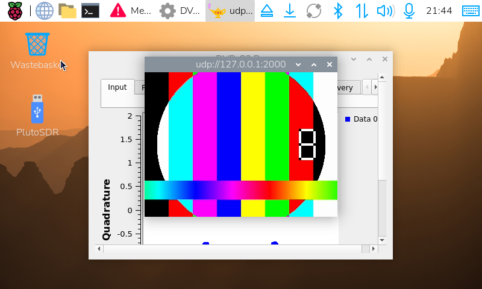

# 山崎慎慈氏によるRaspberry Pi 4 DVB-S2受信システムの再捕捉安定化に関する技術報告　準備編


プロジェクト: rpi-dvbs2-receiver-gui
日付: 2026-07-13

# Credits

- 方式考案・原システム設計・統合：山崎慎慈氏
- 受信安定化調査・再捕捉修正・運用スクリプト実装：真城和一

# 試験概要

Raspberry Pi 4 + PlutoSDR による DVB-S2 受信ソフトウェア(`rpi-dvbs2-receiver-gui`)のビルド環境整備後、PlutoSDR の TX/RX を同軸ケーブルとアッテネータで直結するループバック構成により、受信パイプラインの一気通貫動作を確認した。

# 試験環境

| 項目 | 内容 |
|---|---|
| 本体 | Raspberry Pi 4 |
| OS | Debian GNU/Linux 13 (trixie) 64-bit |
| ホスト名 | DVB-S2 (192.168.0.135) |
| SDR | PlutoSDR Rev.C (Z7010-AD9364) |
| GNU Radio | 3.10.12.0 |
| gr-dvbs2rx | ソースビルド (igorauad/gr-dvbs2rx, `dvbs2rx_rx_hier` 公式リファレンスを使用) |
| GTK4 | 4.18.6 |

# 試験構成

```
PlutoSDR TX ── 同軸ケーブル ── 固定アッテネータ 40dB ── PlutoSDR RX
```

同一 PlutoSDR デバイス内の TX/RX ポートを外部ケーブルとアッテネータで接続し、自己ループバックとした。

## 送信側

`dvbs2-tx`(gr-dvbs2rx 付属 CLI)を使用し、ffmpeg で生成したテスト用 MPEG-TS ファイル(カラーバー映像)を DVB-S2 変調して PlutoSDR TX から送信した。

```
dvbs2-tx --source file --in-file test.ts --in-repeat \
  --sink plutosdr --plutosdr-addr ip:192.168.2.1 --plutosdr-attn 0 \
  -f 438022000 -m QPSK1/4 -s 333000 -o 4 -r 0.2
```

## 受信側

本プロジェクトの実運用スクリプトをそのまま使用した。

```
./start_rx.sh 438022000 QPSK1/4 333000
```

内部で `RF_UDP_dvbs2_rx.py`(GNU Radio DVB-S2 受信フローグラフ)と `ffplay`(UDP 127.0.0.1:2000 の再生)が起動する。

## 送受信パラメータ

| パラメータ | 値 |
|---|---|
| 周波数 | 438.022 MHz |
| MODCOD | QPSK 1/4 |
| シンボルレート | 333 kSym/s |
| SPS(オーバーサンプリング比) | 4 |
| ロールオフ | 0.20 |
| Gold Code | 0 |

# 試験結果

| 確認項目 | 結果 |
|---|---|
| PlutoSDR 認識(USB / ネットワーク) | OK |
| RF 信号到達確認(RSSI 変化) | OK |
| DVB-S2 物理層ロック | OK |
| TS 復調・データ出力 | OK(約17秒間で約137万バイト、途切れなく継続) |
| UDP → ffplay 再生 | OK(テスト映像を継続再生) |
| GTK4 GUI(`app`)起動 | OK(別途確認済み) |

受信フローグラフのコンステレーション表示、ffplay 上でのテスト映像(カラーバー、タイムスタンプカウンタ)の継続的な更新を実機画面で確認した。下図はその際のスクリーンショットである。



画面左上に ffplay ウィンドウ(`udp://127.0.0.1:2000`)でカラーバーテスト映像が表示されている。背後には受信フローグラフの Qt GUI(コンステレーション表示含む)が確認できる。デスクトップの PlutoSDR アイコンはデバイス認識を示す。

# 判明した事項・申し送り

- 元リポジトリに含まれていなかった `dvbs2rx_rx_hier`(GRC 階層ブロック)は、gr-dvbs2rx 公式リポジトリの `examples/dvbs2rx_rx_hier.grc` をコンパイルして解決した。パラメータ構成が `RF_UDP_dvbs2_rx.py` の要求と完全に一致することを確認済み。
- 同じく含まれていなかった `dvbs2_rx_epy_block_0`(埋め込み Python ブロック)は、原実装が不明のため単純パススルー実装で代替した。今回の試験では問題なく機能している。
- `RF_UDP_dvbs2_rx.py` 内の `blocks_file_sink_0`(`tmp.ts` 書き込み用)は、コード上未接続(dead code)であり、実際には機能していない。動作検証には使用不可。
- 送信側のアッテネーション調整により受信レベルを最適化した(`--plutosdr-attn` をデフォルト 10dB から 0dB に変更し、外部固定アッテネータ 40dB と合わせて実効減衰量を調整)。
- 実際の対向局・実信号(実際の DATV 送信、他局からの電波)での検証は未実施。

# 結論

Raspberry Pi 4 + PlutoSDR 上に構築した DVB-S2 受信ビルド環境は、TX/RX ループバック試験において物理層ロックから TS 復調、UDP 経由での映像再生まで一貫して正常に動作することを確認した。
